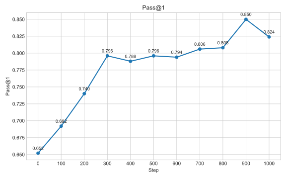
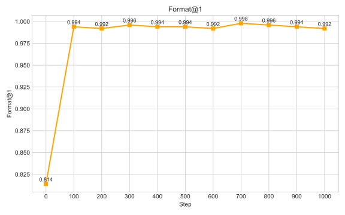
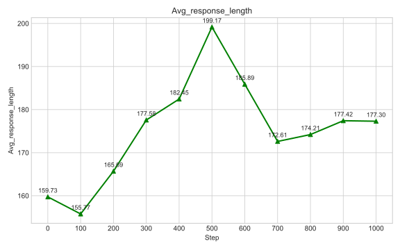

# Simple GRPO

This repository provides a clean and minimal implementation of the **Group Relative Policy Optimization (GRPO)** algorithm. 

## Overview

The primary goal of this project is to facilitate a deep understanding of the core mechanics of GRPO by avoiding the complex abstractions and heavy encapsulations found in mainstream Reinforcement Learning frameworks.

This project is modified from [lsdefine/simple_GRPO](https://github.com/lsdefine/simple_GRPO). We would like to express our gratitude to the original authors for their excellent open-source implementation.

## Prerequisites & Installation

### Environment Setup
We recommend using **PyTorch 2.6** with **CUDA 12.4**. Ensure your environment meets these requirements for optimal performance.

### Install Dependencies
Clone the repository and run the following command to install the necessary libraries:
```bash
pip install -r requirements.txt
```

## How to Run

Running this project requires at least **2 GPUs** on a single machine:
* **1 GPU** is dedicated to running the **Reference Model**.
* The **remaining GPUs** are used for the **GRPO Training**.

### Step 1: Start the Reference Model
Open a terminal and run the reference model on the first GPU:
```bash
CUDA_VISIBLE_DEVICES=0 python ref.py
```

### Step 2: Start GRPO Training
Open a **new terminal** and launch the GRPO algorithm using DeepSpeed (example using 4 GPUs in total):
```bash
CUDA_VISIBLE_DEVICES=1,2,3 deepspeed grpo.py
```

### Configuration Note
* **Model:** The default model is `Qwen2.5-1.5B-Instruct`. If it is not found locally, it will be downloaded automatically from Hugging Face (requires a stable internet connection).
* **Customization:** You can change the model by modifying the `model_name_or_path` variable in both `ref.py` and `grpo.py`.
* **Hyperparameters:** Other training-related parameters (learning rate, batch size, etc.) can be adjusted directly within `grpo.py`.

## Experimental Results

We evaluated the implementation by training `Qwen2.5-1.5B-Instruct` on 4 * RTX 4090 D GPUs.

* **Dataset:** 3,000 questions randomly sampled from the GSM8K training split. The GSM8K training split used here is provided as `QAs.pkl` in this project.
* **Training:** 1 Epoch.
* **Evaluation:** 500 questions randomly sampled from the GSM8K training split. Detailed testing logic can be found in `test_model.py`.

### Performance Visualizations
<p align="center">
  <br>
  <br>
  
</p>
